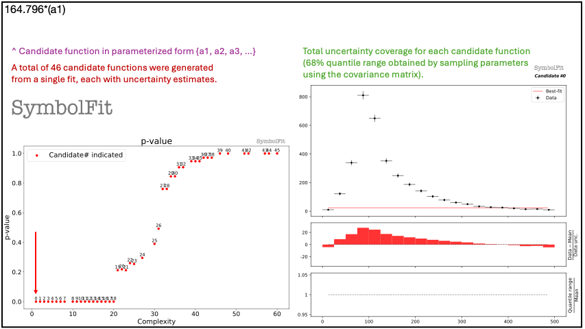

<p align="center">
  
</p>

<div align="center">
  


</div>

<div align="center">

Docs | GitHub | pip | conda | Paper | Colab |
|:-:|:-:|:-:|:-:|:-:|:-:|
[](https://symbolfit.readthedocs.io) | [](https://github.com/hftsoi/symbolfit) <br /> [](https://github.com/hftsoi/symbolfit/releases) <br /> [](https://github.com/hftsoi/symbolfit/releases) | [](https://pypi.org/project/symbolfit) <br /> [](https://www.pepy.tech/projects/symbolfit) | [](https://anaconda.org/conda-forge/symbolfit) <br /> [](https://anaconda.org/conda-forge/symbolfit) | | [](https://colab.research.google.com/github/hftsoi/symbolfit/blob/main/colab_demo/symbolfit_colab.ipynb) |

</div>

An API to automate parametric modeling with symbolic regression, originally developed for data analysis in the experimental high-energy physics community, but also applicable beyond.

SymbolFit takes binned data with measurement/systematic uncertainties as input, utilizes [PySR](https://github.com/MilesCranmer/PySR) to perform a machine-search for batches of functional forms that model the data, parameterizes these functions, and utilizes [LMFIT](https://github.com/lmfit/lmfit-py) to re-optimize the functions and provide uncertainty estimation, all in one go.
It is designed to maximize automation with minimal human input. Each run produces a batch of functions with uncertainty estimation, which are evaluated, saved, and plotted automatically into readable output files, ready for downstream tasks.

- [Installation](#installation)
- [Getting Started](#getting-started)
- [Documentation](#documentation)
- [Citation](#citation)

We continue to improve SymbolFit to adapt to more use cases, so any feedback and contributions are very welcome and appreciated!

## Installation
**Prerequisite**

Install Julia (backend for PySR):
```
curl -fsSL https://install.julialang.org | sh
```
Then check if installed properly:
```
julia --version
```
If julia is not found, most properly it is not yet included in PATH. To include, do:
```
export PATH="$PATH:/path/to/<Julia directory>/bin"
```
Check out [here](https://julialang.org/downloads/platform) for platform-specific instructions.

Afterward, it is recommended to start from an empty virtual environment for installing and running SymbolFit.

‣ **Installation via PyPI**

With python>=3.9 and pip:
```
pip install symbolfit
```

‣ **Installation via conda**

```
conda create --name symbolfit_env python=3.9
conda activate symbolfit_env
conda install -c conda-forge symbolfit
```

‣ **Editable installation for developers**

```
git clone https://github.com/hftsoi/symbolfit.git
cd symbolfit
pip install -e .
```

## Getting Started
To run an example fit, get the example datasets by cloning this repo:
```
git clone https://github.com/hftsoi/symbolfit.git
cd symbolfit
```
Then within a python session (or simply do ```python fit_example.py```):
```
from symbolfit.symbolfit import *

dataset = importlib.import_module('examples.datasets.toy_dataset_1.dataset')
pysr_config = importlib.import_module('examples.pysr_configs.pysr_config_gauss').pysr_config

model = SymbolFit(
    	x = dataset.x,
    	y = dataset.y,
    	y_up = dataset.y_up,
    	y_down = dataset.y_down,
    	pysr_config = pysr_config,
    	max_complexity = 60,
    	input_rescale = True,
    	scale_y_by = 'mean',
    	max_stderr = 20,
    	fit_y_unc = True,
    	random_seed = None,
    	loss_weights = None
)

model.fit()
```
After the fit, save results to csv files:
```
model.save_to_csv(output_dir = 'output_dir/')
```
and plot results to pdf files:
```
model.plot_to_pdf(
    	output_dir = 'output_dir/',
    	bin_widths_1d = dataset.bin_widths_1d,
    	#bin_edges_2d = dataset.bin_edges_2d,
    	plot_logy = False,
    	plot_logx = False,
        sampling_95quantile = False
)
```
Candidate functions with full substitutions can be printed promptly:
```
model.print_candidate(candidate_number = 20)
```

Each fit will produce a batch of candidate functions and will automatically save all results to six output files:
1) ```candidates.csv```: saves all candidate functions and evaluations in a csv table.
2) ```candidates_reduced.csv```: saves a reduced version for essential information without intermediate results.
3) ```candidates.pdf```: plots all candidate functions with associated uncertainties one by one for fit quality evaluation.
4) ```candidates_sampling.pdf```: plots all candidate functions with total uncertainty coverage generated by sampling parameters.
5) ```candidates_gof.pdf```: plots the goodness-of-fit scores.
6) ```candidates_correlation.pdf```: plots the correlation matrices for the parameters of the candidate functions.

Output files from an example fit can be found and downloaded at [here](https://github.com/hftsoi/symbolfit/tree/main/docs/demo/output_dir/toy_dataset_1) for illustration.

For detailed instructions and more demonstrations, please check out the Colab notebook and the documentation.

## Documentation
The documentation can be found [here](https://symbolfit.readthedocs.io) for more information and demonstrations.

## Citation
If you find this useful in your research, please consider citing SymbolFit:
```
Coming soon!
```
and PySR:
```
@misc{cranmerInterpretableMachineLearning2023,
    title = {Interpretable {Machine} {Learning} for {Science} with {PySR} and {SymbolicRegression}.jl},
    url = {http://arxiv.org/abs/2305.01582},
    doi = {10.48550/arXiv.2305.01582},
    urldate = {2023-07-17},
    publisher = {arXiv},
    author = {Cranmer, Miles},
    month = may,
    year = {2023},
    note = {arXiv:2305.01582 [astro-ph, physics:physics]},
    keywords = {Astrophysics - Instrumentation and Methods for Astrophysics, Computer Science - Machine Learning, Computer Science - Neural and Evolutionary Computing, Computer Science - Symbolic Computation, Physics - Data Analysis, Statistics and Probability},
}
```

