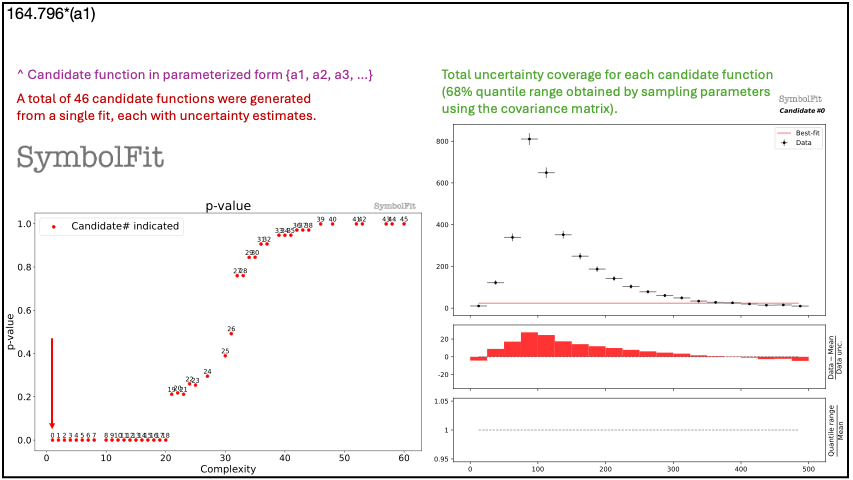

<p align="center">
  
</p>

<p align="center">
  
</p>

<div align="center">
  


</div>

<div align="center">

Docs | Paper | Slides | Colab | pip | conda |
|:-:|:-:|:-:|:-:|:-:|:-:|
[](https://hftsoi.github.io/symbolfit) | [](https://arxiv.org/abs/2411.09851) | [](https://github.com/hftsoi/symbolfit/blob/main/symbolfit.pdf) | [](https://colab.research.google.com/github/hftsoi/symbolfit/blob/main/colab_demo/symbolfit_colab.ipynb) | [](https://pypi.org/project/symbolfit) | [](https://anaconda.org/conda-forge/symbolfit) |

</div>

## What is SymbolFit?

**SymbolFit automatically finds closed-form functions that fit your data with uncertainty estimation, no manual guessing required.**

SymbolFit was originally developed for experimental high-energy physics (HEP) analyses, but it works on any 1D, 2D, or higher-dimensional dataset where you need an interpretable parametric model with uncertainty estimates. You provide data points and SymbolFit returns a batch of candidate functions ranked by goodness-of-fit, each with optimized parameters and uncertainty estimates. All results are saved to CSV tables and PDF plots, ready for downstream use such as hypothesis testing in HEP.

Under the hood, it chains three steps into a single pipeline:

1. **Function search**: [PySR](https://github.com/MilesCranmer/PySR) (symbolic regression) explores combinations of mathematical operators to discover functional forms that fit the data, without requiring a predefined template.
2. **Re-optimization**: [LMFIT](https://github.com/lmfit/lmfit-py) re-optimizes the numerical parameters in each candidate function and provides uncertainty estimates via covariance matrices.
3. **Evaluation**: every candidate is automatically scored (chi2/NDF, p-value, RMSE, R2), plotted with individual uncertainty variations and total uncertainty coverage, and saved to output files.

- [Installation](#installation)
- [Quick Start](#quick-start)
- [Fit Your Own Data](#fit-your-own-data)
- [Documentation](#documentation)
- [Citation](#citation)

## Installation

**Installation via PyPI** (recommended), with Python>=3.10:
```
pip install symbolfit
```

<details>
  <summary>Installation via conda</summary>
  
  ```
  conda create --name symbolfit_env python=3.10
  conda activate symbolfit_env
  conda install -c conda-forge symbolfit
  ```
</details>

Julia (the backend for PySR) is installed automatically the first time you import PySR (one-time setup):
```python
import pysr
```

## Quick Start

A minimal fit to verify the installation works:

```python
from symbolfit.symbolfit import *

model = SymbolFit(
    x = [1, 2, 3, 4, 5],
    y = [2.1, 4.0, 5.9, 6.5, 6.9],
    y_up = [0.5, 0.5, 0.5, 0.5, 0.5],
    y_down = [0.5, 0.5, 0.5, 0.5, 0.5],
    max_complexity = 15,
)
model.fit()

model.save_to_csv(output_dir = 'results/')
model.plot_to_pdf(output_dir = 'results/')
```

### Full example with more options

For a more realistic fit, clone the repo to get the example datasets and configs:
```bash
git clone https://github.com/hftsoi/symbolfit.git
cd symbolfit
```
Then run the example (or simply do `python fit_example.py`):
```python
from symbolfit.symbolfit import *
import importlib

# Load an example dataset and PySR configuration
dataset = importlib.import_module('examples.datasets.toy_dataset_1.dataset')
pysr_config = importlib.import_module('examples.pysr_configs.pysr_config_gauss').pysr_config

# Set up and run the fit
model = SymbolFit(
    x = dataset.x,              # Independent variable (bin centers for histograms)
    y = dataset.y,              # Dependent variable (bin contents for histograms)
    y_up = dataset.y_up,        # +1 sigma uncertainty on y (set to 1 if no uncertainty)
    y_down = dataset.y_down,    # -1 sigma uncertainty on y (set to 1 if no uncertainty)
    pysr_config = pysr_config,  # PySR search config (operators, iterations, etc.)
    max_complexity = 60,        # Max expression tree size; higher = more complex functions
    input_rescale = True,       # Rescale x to (0, 1) to avoid numerical instability
    scale_y_by = 'mean',        # Normalize y by its 'mean', 'max', 'l2', or None
    max_stderr = 20,            # Max parameter uncertainty (%); refit if exceeded
    fit_y_unc = True,           # Use uncertainties as weights in chi2 loss
    random_seed = None,         # Set int for reproducibility (forces single-thread)
    loss_weights = None         # Per-bin loss weights; overrides y_up/y_down if set
)
model.fit()

# Save results
model.save_to_csv(output_dir = 'output_dir/')
model.plot_to_pdf(
    output_dir = 'output_dir/',
    bin_widths_1d = dataset.bin_widths_1d, # Bin widths for 1D histogram-style plots
    plot_logy = False,                     # Log scale for y-axis
    plot_logx = False,                     # Log scale for x-axis
    sampling_95quantile = False,           # Show 95% uncertainty band (default: 68% only)
)
```

When it finishes, six output files are produced:

| File | What it contains |
|------|-----------------|
| `candidates.csv` | All candidate functions with parameters, uncertainties, covariance matrices, and goodness-of-fit scores |
| `candidates_compact.csv` | Compact version with only final functions, parameters, and key metrics |
| `candidates.pdf` | Each candidate plotted against data, with per-parameter uncertainty variations and residual panels |
| `candidates_sampling.pdf` | Total uncertainty bands from Monte Carlo parameter sampling (1D only) |
| `candidates_gof.pdf` | Summary of goodness-of-fit metrics (chi2/NDF, p-value, RMSE, R2) across all candidates |
| `candidates_correlation.pdf` | Parameter correlation matrices for each candidate |

You can browse the output files from this example fit [here](https://github.com/hftsoi/symbolfit/tree/main/docs/demo/output_dir/toy_dataset_1).

> **Tip:** The function space is vast. Each run with `random_seed = None` explores different regions and returns a different batch of candidates. If the first run doesn't produce a satisfactory fit, simply rerun with the same config. After several runs, if results are still unsatisfactory, try adjusting the PySR config (e.g., different operators or higher `max_complexity`) and the various fit options.

## Fit Your Own Data

To fit your own data, replace the `x`, `y`, `y_up`, `y_down` with your own Python lists or NumPy arrays, as shown in the minimal example above. For details on input data format (1D histograms, 2D histograms, etc.), see the [input format guide](https://hftsoi.github.io/symbolfit/demo/input/).

**No input uncertainties?** Simply omit `y_up` and `y_down` (they default to 1), and set `fit_y_unc = False` for an unweighted least-squares fit.

**Custom PySR config:** The default PySR config includes simple operators (`+`, `*`, `/`, `^`). For your data, you may want to customize this and put some equation constraints. See the [PySR config examples](https://hftsoi.github.io/symbolfit/demo/pysr_configs/) in the docs.

## Documentation
Full documentation with tutorials, demo fits, and API reference is available **[here](https://hftsoi.github.io/symbolfit)**.

You can also try SymbolFit directly in the browser with the **[Colab notebook](https://colab.research.google.com/github/hftsoi/symbolfit/blob/main/colab_demo/symbolfit_colab.ipynb)** (no local installation needed).

## Citation
If you find this useful in your research, please consider citing both SymbolFit and PySR:
```
@article{Tsoi:2024pbn,
    author = "Tsoi, Ho Fung and Rankin, Dylan and Caillol, Cecile and Cranmer, Miles and Dasu, Sridhara and Duarte, Javier and Harris, Philip and Lipeles, Elliot and Loncar, Vladimir",
    title = "{SymbolFit: Automatic Parametric Modeling with Symbolic Regression}",
    eprint = "2411.09851",
    archivePrefix = "arXiv",
    primaryClass = "hep-ex",
    doi = "10.1007/s41781-025-00140-9",
    journal = "Comput. Softw. Big Sci.",
    volume = "9",
    pages = "12",
    year = "2025"
}

@misc{cranmerInterpretableMachineLearning2023,
      title = {Interpretable {Machine} {Learning} for {Science} with {PySR} and {SymbolicRegression}.jl},
      url = {http://arxiv.org/abs/2305.01582},
      doi = {10.48550/arXiv.2305.01582},
      urldate = {2023-07-17},
      publisher = {arXiv},
      author = {Cranmer, Miles},
      month = may,
      year = {2023},
      note = {arXiv:2305.01582 [astro-ph, physics:physics]},
      keywords = {Astrophysics - Instrumentation and Methods for Astrophysics, Computer Science - Machine Learning, Computer Science - Neural and Evolutionary Computing, Computer Science - Symbolic Computation, Physics - Data Analysis, Statistics and Probability},
}
```
