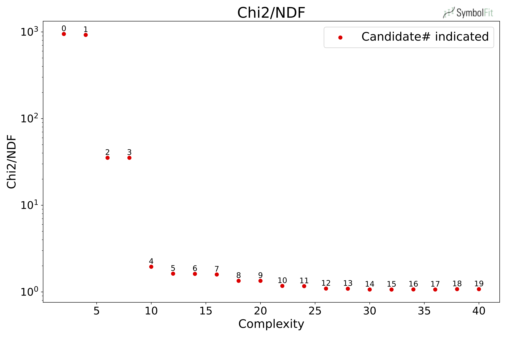
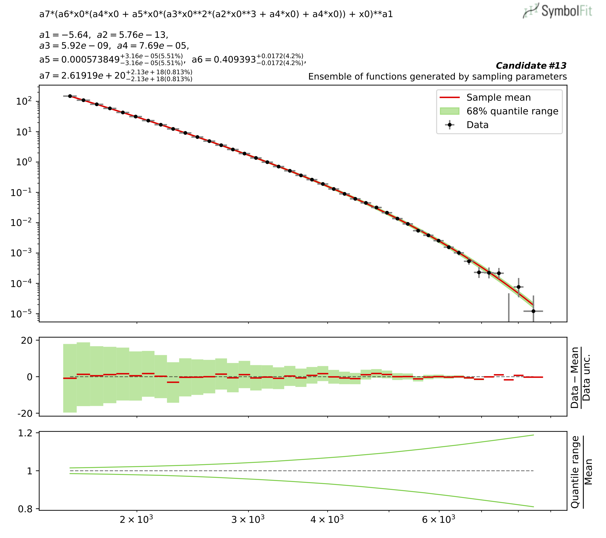

CMS dijet dataset (template spec)
---------------------------------

CMS search for high-mass dijet resonances at sqrt(s) = 13 TeV

* https://arxiv.org/abs/1911.03947

* https://doi.org/10.1007/JHEP05(2020)033

Differential dijet spectrum (Figure 5), public data taken from HEPDATA

* https://www.hepdata.net/record/ins1764471

.. include:: notebooks/dijet_template_spec.rst

This fit generates 20 candidate functions in total! The output files can be found `here <https://github.com/hftsoi/symbolfit/tree/main/docs/demo/notebooks/output_dijet_template_spec>`_ (feel free to download them and look at what a typical fit will produce).

Let's look at the output file ``candidates_compact.csv``, which is a csv table storing all candidate functions and their evaluations:

.. csv-table:: candidates_compact.csv
   :file: notebooks/output_dijet_template_spec/candidates_compact.csv

Recall that we used the ``pysr.TemplateExpressionSpec`` method to constrain the structure of final expressions to be of "dijet-like" (see pysr config above): ``p[1] * f(x/13000) ^ g(log(x/13000))``, while requiring both ``f`` and ``g`` to be polynomials. The searched ``f`` and ``g`` are shown in the ``PySR template spec`` column of the full csv file ``candidates.csv``. The expressions shown in ``candidates_compact.csv`` and pdf files are after simplified algebraically.

The goodness-of-fit scores are plotted in ``candidates_gof.pdf``, such as the chi2/ndf:

For other goodness-of-fit scores:

.. toggle::

   .. image:: notebooks/img/dijet_template_spec/gof-pvalue.png

   **^ p-value**

   .. image:: notebooks/img/dijet_template_spec/gof-rmse.png

   **^ Root-mean-square error**

   .. image:: notebooks/img/dijet_template_spec/gof-r2.png

   **^ Coefficient of determination R2**

Now, let's take a look at one of the candidate functions, say candidate #13. The functional form can be found in the corresponding plots from the PDF files and in the csv table above, which is (after some algebraic simplication of the original template ``p[1] * f(x/13000) ^ g(log(x/13000))``):

``a7*(a6*x0*(a4*x0 + a5*x0*(a3*x0**2*(a2*x0**3 + a4*x0) + a4*x0)) + x0)**a1``.

To see what the template expressions ``f`` and ``g`` look like, they can be found in the ``PySR template spec`` column in the full ``candidates.csv`` file:

``f = ((((((#1 * ((((#1 * #1) * (#1 * 1.2657217)) + #1) * #1)) + #1) * #1) * 7.4338403) + #1) * (#1 * 0.4126327)) + #1; g = -5.635317; p = [0.0016633321]``.

In this case, ``f`` is a polynomial of ``x/13000`` of some degrees, and ``g`` is a constant function. Therefore, the algorithm finds that such a combination is already good to fit the dijet spectrum without needing a polynomial of ``log(x/13000)`` in the exponent ``g``. Other suitable candidate functions may have very different combinations in ``f`` and ``g``, as the equation space is still very large.

This candidate function has 7 parameters, originally: ``a1``, ``a2``, ``a3``, ``a4``, ``a5``, ``a6``, ``a7``.
However, there are only 3 final varying parameters: ``a5``, ``a6``, ``a7``, as can be seen from the ``Parameters: (best-fit, +1, -1)`` column in the csv tables or directly from the pdf files:

``{'a1': (-5.64, 0, 0), 'a2': (5.76e-13, 0, 0), 'a3': (5.92e-09, 0, 0), 'a4': (7.69e-05, 0, 0), 'a5': (0.000573849, 3.16e-05, -3.16e-05), 'a6': (0.409393, 0.0172, -0.0172), 'a7': (2.61919e+20, 2.13e+18, -2.13e+18)}``

where ``a1``, ``a2``, ``a3``, ``a4`` have zeros at both +1 and -1 unc entries, meaning they were both held fixed during the re-optimization. This is because during the re-optimization loop, the objective function was too complex to minimize, therefore some parameters are held fixed to lower the number of degrees of freedom in order to achieve a better fit. This is common when the functions or the distribution shapes are not very simple.

To see how this candidate function behaves when each of these 3 parameters is varied to its +/-1 sigma value:

.. toggle::

   .. image:: notebooks/img/dijet_template_spec/p5.png

   **^ +/-1 sigma variations of parameter a5**

   .. image:: notebooks/img/dijet_template_spec/p6.png

   **^ +/-1 sigma variations of parameter a6**

   .. image:: notebooks/img/dijet_template_spec/p7.png

   **^ +/-1 sigma variations of parameter a7**

   .. image:: notebooks/img/dijet_template_spec/corr.png

   **^ Correlation matrix**

As shown in the correlation matrix, these parameters are very anti-/correlated in this case, so it will be nice to see the actual uncertainty coverage considering uncertainties from all parameters in a candidate function.
These are plotted in ``candidates_sampling.pdf``.
Here, what it does is to generate an ensemble of functions for a candidate function by sampling its parameters, where the sampling is done by sampling from a multidimensional normal distribution for the parameters, with the best-fit parameter values being the mean location and the covariance matrix for the parameters being the covarience.
In this way, the total uncertainty is obtained by considering uncertainties from all parameters simultaneously.
Then the 68% quantile range of this function ensemble as green bands in the plots and compared with the input data.

Note the 95% quantile range can also be added by ``sampling_95quantile = True``.
