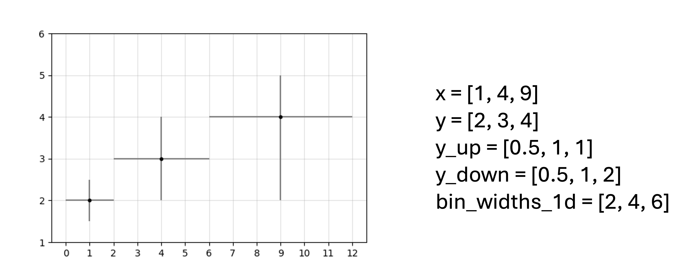
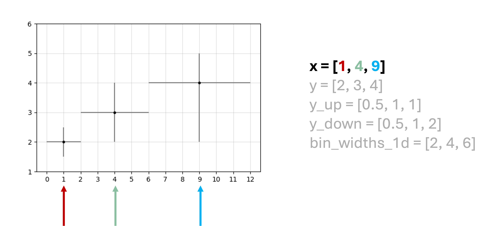
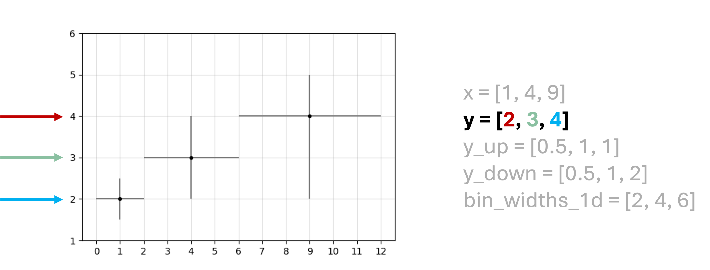
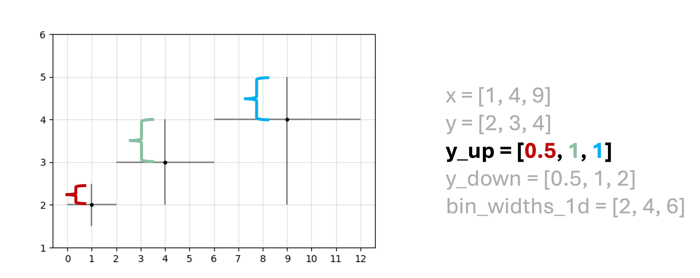
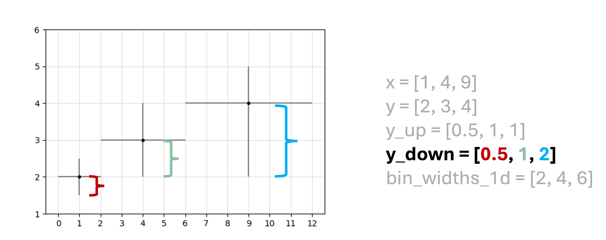
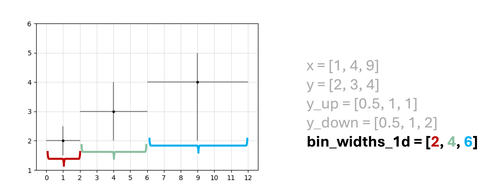
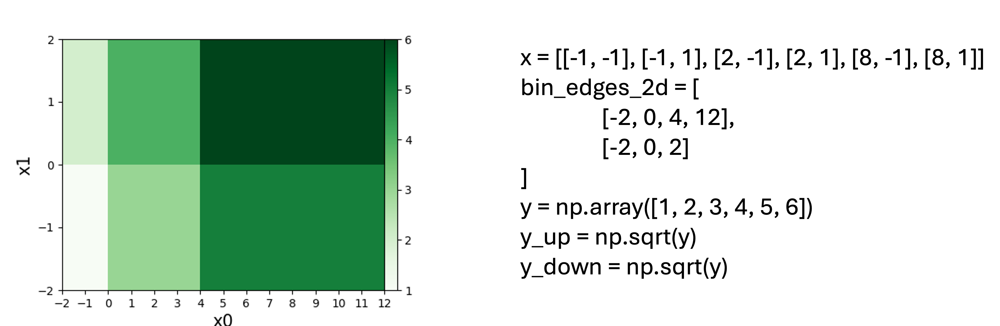
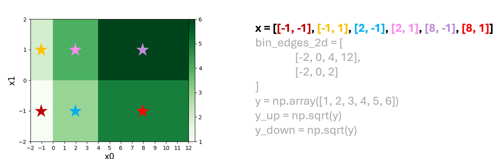
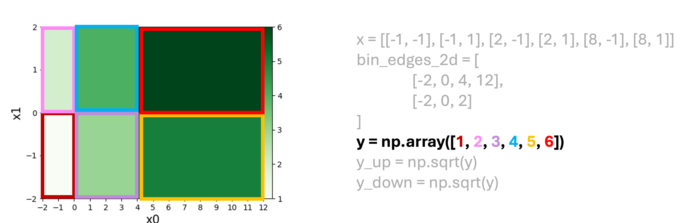
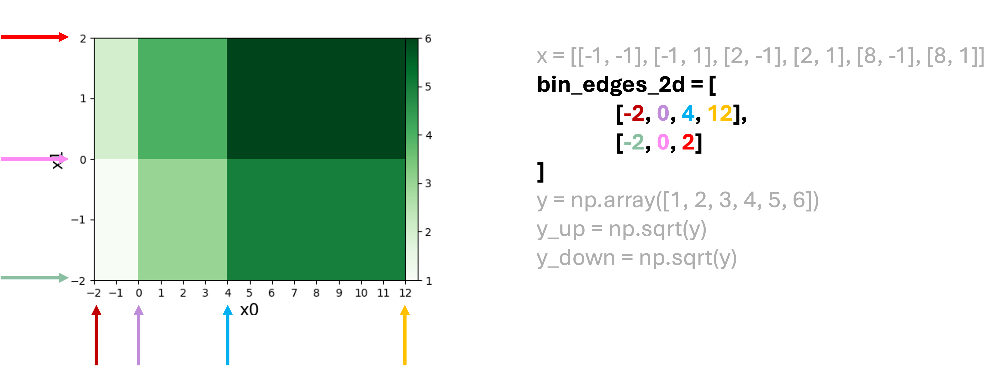

Input format
============

1D input data
-------------

For illustration, consider a simple example 1D input data:

.. code-block:: python

  x = [1, 4, 9]
  y = [2, 3, 4]
  y_up = [0.5, 1, 1]
  y_down = [0.5, 1, 2]
  bin_widths_1d = [2, 4, 6]

- ``x`` is the independent variable corresponding to the bin center location, and ``y`` is the dependent variable corresponding to the bin content.
- ``y_up`` and ``y_down`` are the upside and downside uncertainties, respectively.
- Both ``y_up`` and ``y_down`` are the distance values from the nominal value ``y`` and therefore are non-negative by definition.
- ``bin_widths_1d`` is the bin width in ``x``.
- If your data do not have uncertainty in ``y``, you can set both ``y_up`` and ``y_down`` to ones with the same shape as ``y``. This way the objective function simply becomes from chi2 to MSE.
- Each of these can be either a python list or a numpy array, with the same shape of (n, 1), and they should have the same ordering in the elements.

A graphical illustration is provided below.

2D input data
-------------

For illustration, consider a simple example 2D input data:

.. code-block:: python
  x = [[-1, -1], [-1, 1], [2, -1], [2, 1], [8, -1], [8, 1]]
  y = np.array([1, 2, 3, 4, 5, 6])
  y_up = np.sqrt(y)
  y_down = np.sqrt(y)
  bin_edges_2d = [
    [-2, 0, 4, 12],
    [-2, 0, 2]
  ]

- ``x`` is the independent variable corresponding to the bin center location, where each element is a 2D bin location [x0, x1], and ``x`` has a shape of (n, 2).
- ``y`` is the dependent variable corresponding to the bin content and has a shape of (n, 1).
- Both ``y_up`` and ``y_down`` are the distance values from the nominal value ``y`` and therefore are non-negative by definition, which has a shape of (n, 1).
- If your data do not have uncertainty in ``y``, you can set both ``y_up`` and ``y_down`` to ones with the same shape as ``y``. This way the objective function simply becomes from chi2 to MSE.
- The above can be either a python list or a numpy array.
- ``bin_edges_2d`` is the bin edges for both dimensions, containing two lists where the first one is the bin edges for x0 and the second one is the bin edges for x1, including both the leftmost and rightmost bin edge locations.

  - ``bin_edges_2d`` should be a python list that contains two sub lists, where the first sub list is [x0_0, x0_1,...] which has (num_x0_bins + 1) elements, and the second sub list is [x1_0, x1_1,...] which has (num_x1_bins + 1) elements.
  - Therefore it is better not to assume a numpy array for it since (num_x0_bins + 1) =/= (num_x1_bins + 1) is possible.

A graphical illustration is provided below.

