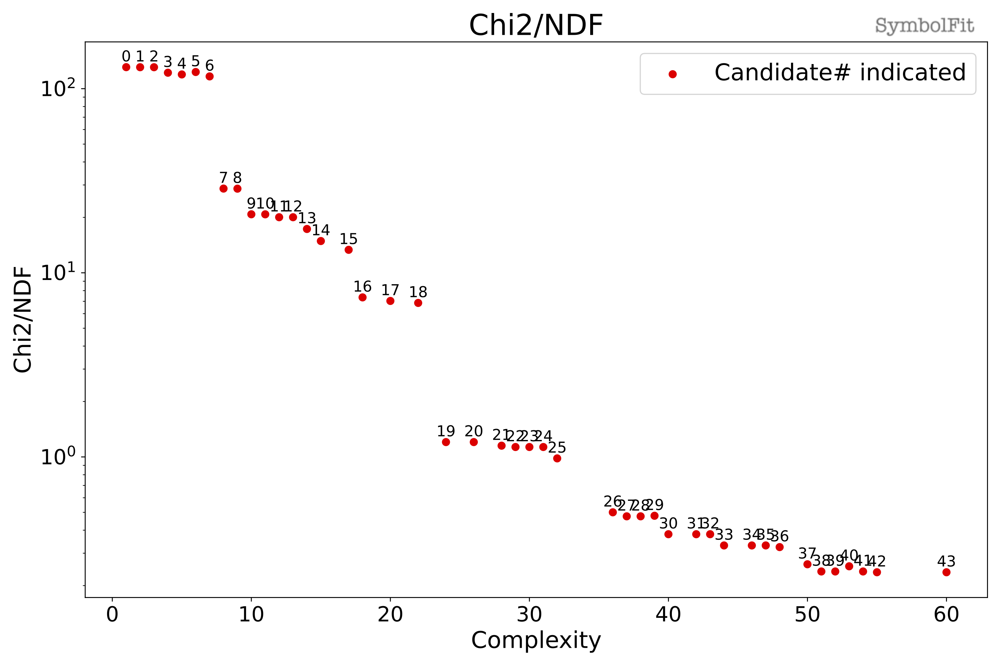
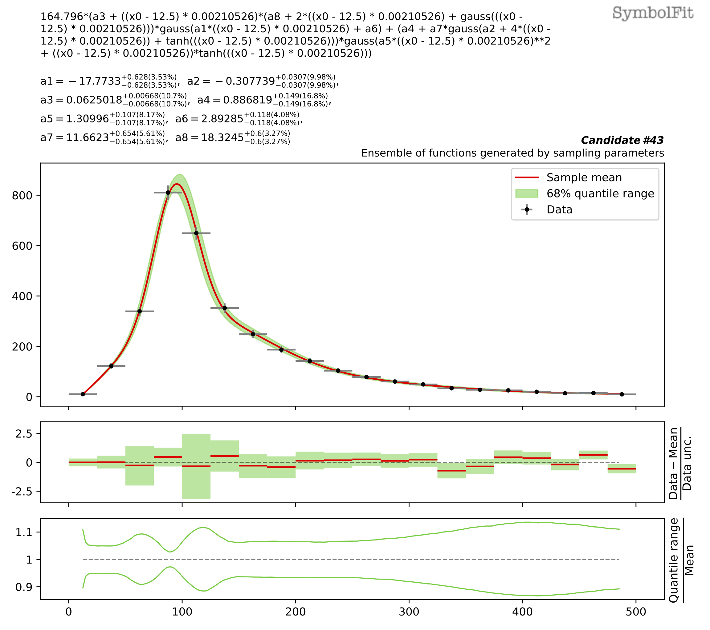

Toy dataset 1
-------------

.. include:: notebooks/Toy_dataset_1.rst

This fit generates 44 candidate functions in total! The output files can be found `here <https://github.com/hftsoi/symbolfit/tree/main/docs/demo/notebooks/output_Toy_dataset_1>`_ (feel free to download them and look at what a typical fit will produce).

Let's look at the output file ``candidates_reduced.csv``, which is a csv table storing all candidate functions and their evaluations:

.. csv-table:: candidates_reduced.csv
   :file: notebooks/output_Toy_dataset_1/candidates_reduced.csv

The goodness-of-fit scores are plotted in ``candidates_gof.pdf``, such as the chi2/ndf:

.. noted::
    :class: dropdown

    n

.. toggle:: Click to see other goodness-of-fit scores

   .. image:: notebooks/img/toy1/gof-pvalue.png

   **^ p-value**

   .. image:: notebooks/img/toy1/gof-rmse.png

   **^ Root-mean-square error**

   .. image:: notebooks/img/toy1/gof-r2.png

   **^ Coefficient of determination R2**

Now, let's take a look at one of the candidate functions, say candidate #43. The functional form can be found in the corresponding plots from the PDF files and in the csv table above, which is:

``164.796*(a3 + ((x0 - 12.5) * 0.00210526)*(a8 + ((x0 - 12.5) * 0.00210526))*gauss(a1*((x0 - 12.5) * 0.00210526) + a6) + (a4 + a7*gauss(a2 + 4*((x0 - 12.5) * 0.00210526)) + tanh(((x0 - 12.5) * 0.00210526)))*gauss(a5*((x0 - 12.5) * 0.00210526)**2 + ((x0 - 12.5) * 0.00210526))*tanh(((x0 - 12.5) * 0.00210526)))``.

Here, the function has 164.796*(...), this is the result of ``scale_y_by = 'mean'`` as the input y was scaled by its mean for when performing the fits (to avoid numerical overflow), so this factor is to unscale it after the fits are done so that the final function describes the original input dataset. Also, there is ``(x0 - 12.5) * 0.00210526`` appearing everywhere, this is the result of ``input_rescale = True`` as the input x was scaled to [0,1] when performing the fits and then unscaled afterward.

This candidate function has 8 parameters: ``a1``, ``a2``, ``a3``, ``a4``, ``a5``, ``a6``, ``a7``, ``a8``.
Their best-fit values and +/-1 sigma uncertainties can be found in the corresponding PDF files and in the csv table above.
The individual variations of each parameter in each candidate function are all plotted in ``candidates.pdf``.

.. toggle:: Click to see how this candidate function behave when each of these 8 parameters is varied to its +/-1 sigma value

   .. image:: notebooks/img/toy1/p1.png

   **^ +/-1 sigma variations of parameter a1**

   .. image:: notebooks/img/toy1/p2.png

   **^ +/-1 sigma variations of parameter a2**

   .. image:: notebooks/img/toy1/p3.png

   **^ +/-1 sigma variations of parameter a3**

   .. image:: notebooks/img/toy1/p4.png

   **^ +/-1 sigma variations of parameter a4**

   .. image:: notebooks/img/toy1/p5.png

   **^ +/-1 sigma variations of parameter a5**

   .. image:: notebooks/img/toy1/p6.png

   **^ +/-1 sigma variations of parameter a6**

   .. image:: notebooks/img/toy1/p7.png

   **^ +/-1 sigma variations of parameter a7**

   .. image:: notebooks/img/toy1/p8.png

   **^ +/-1 sigma variations of parameter a8**

   .. image:: notebooks/img/toy1/corr.png

   **^ Correlation matrix**

As shown in the correlation matrix, these parameters are not all independent to each other, so it will be nice to see the actual uncertainty coverage considering uncertainties from all parameters in a candidate function.
These are plotted in ``candidates_sampling.pdf``.
Here, what it does is to generate an ensemble of functions for a candidate function by sampling its parameters, where the sampling is done by sampling from a multidimensional normal distribution for the parameters, with the best-fit parameter values being the mean location and the covariance matrix for the parameters being the covarience.
In this way, the total uncertainty is obtained by considering uncertainties from all parameters simultaneously.
Then the 68% quantile range of this function ensemble as green bands in the plots and compared with the input data.

Note the 95% quantile range can also be added by ``sampling_95quantile = True``.
