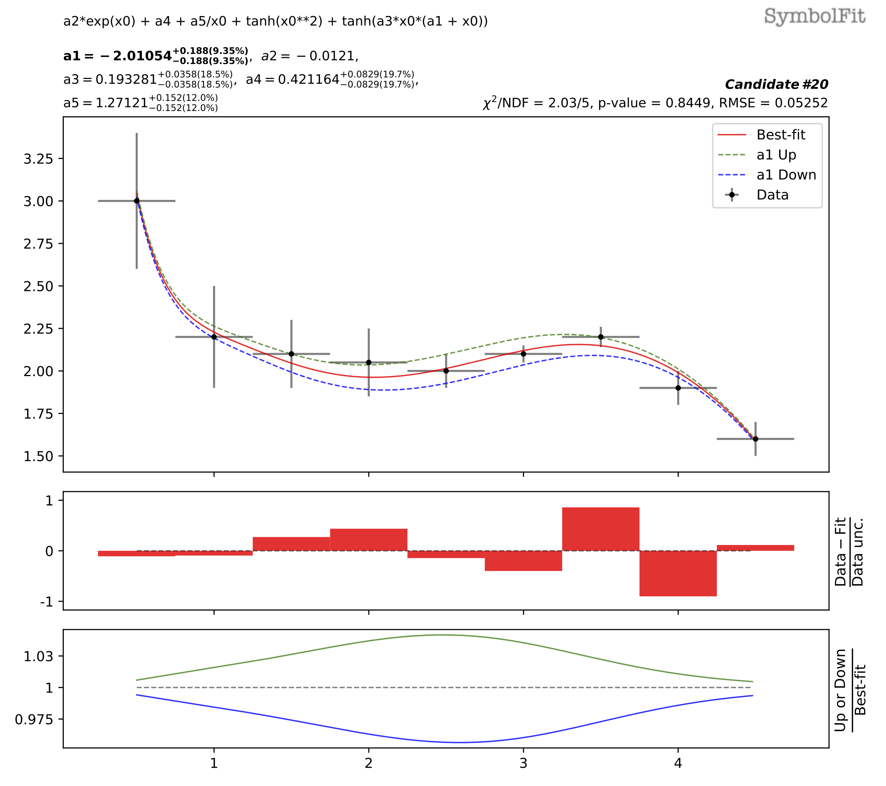

# Toy dataset 2a (1D)

See >>[notebook](notebooks/Toy_dataset_2a.ipynb)<< for the complete procedure.

This fit generates 22 candidate functions in total!
The output files can be found [here](https://github.com/hftsoi/symbolfit/tree/main/docs/demo/notebooks/output_Toy_dataset_2a) (feel free to download them and look at what a typical fit will produce).

Lets look at the output file `candidates_reduced.csv`, which is a csv table storing all candidate functions and their evaluations:

{{ read_csv("notebooks/output_Toy_dataset_2a/candidates_reduced.csv") }}

The goodness-of-fit scores are plotted in `candidates_gof.pdf`, such as the chi2/ndf:

For other goodness-of-fit scores:

??? note "Click to expand"
    

    **^ p-value**

    

    **^ Root-mean-square error**

    

    **^ Coefficient of determination R2**

Now, lets take a look at one of the candidate functions, say candidate #20.
The functional form can be found in the corresponding plots from the PDF files and in the csv table above, which is:

`a2*exp(x0) + a4 + a5/x0 + tanh(x0**2) + tanh(a3*x0*(a1 + x0))`.

Unlike the previous example (toy1), here we have set `input_rescale = False` and `scale_y_by = None` when configuring the fits since the x and y of this dataset are already O(1) and there is no need to scale them to prevent numerical overflow (of course you still can if you want).
Therefore the functions here appear slightly cleaner, i.e., no overall normaliztion (rescaling y by c\*(...)) and no un-standardization (rescaling x -> c\*(x-b)).

This candidate function has 5 parameters, originally: `a1`, `a2`, `a3`, `a4`, `a5`.
However, there are only 4 final varying parameters: `a1`, `a3`, `a4`, `a5`, as can be seen from the
`Parameters: (best-fit, +1, -1)` column in the csv tables or directly from the pdf files:

`{'a1': (-2.01054, 0.188, -0.188), 'a2': (-0.0121, 0, 0), 'a3': (0.193281, 0.0358, -0.0358), 'a4': (0.421164, 0.0829, -0.0829), 'a5': (1.27121, 0.152, -0.152)}`

where `a2` has zeros at both +1 and -1 unc entries, meaning this parameter was held fixed during the re-optimization.
This is because during the re-optimization loop, the objective function was too complex to minimize, therefore some parameters are held fixed to lower the number of degrees of freedom in order to achieve a better fit. 
This is common when the functions or the distribution shapes are not very simple.

To see how this candidate function behaves when each of these 4 parameters is varied to its +/-1 sigma value:

??? note "Click to expand"
    

    **^ +/-1 sigma variations of parameter a1**

    

    **^ +/-1 sigma variations of parameter a3**

    

    **^ +/-1 sigma variations of parameter a4**

    

    **^ +/-1 sigma variations of parameter a5**

    

    **^ Correlation matrix**

As shown in the correlation matrix, these parameters are not all independent to each other, so it will be nice to see the actual uncertainty coverage considering uncertainties from all parameters in a candidate function.
These are plotted in `candidates_sampling.pdf`.
Here, what it does is to generate an ensemble of functions for a candidate function by sampling its parameters, where the sampling is done by sampling from a multidimensional normal distribution for the parameters, with the best-fit parameter values being the mean location and the covariance matrix for the parameters being the covarience.
In this way, the total uncertainty is obtained by considering uncertainties from all parameters simultaneously.
Then the 68% quantile range of this function ensemble as green bands in the plots and compared with the input data.

Note the 95% quantile range can also be added by `sampling_95quantile = True`.
