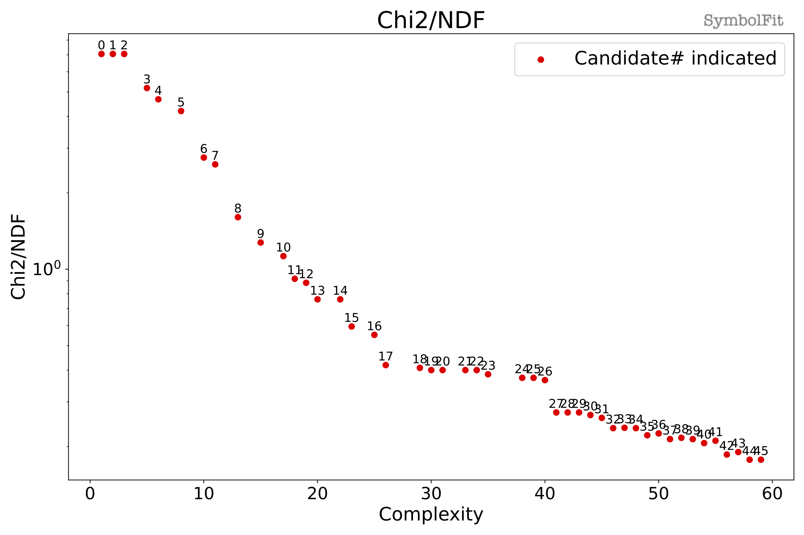
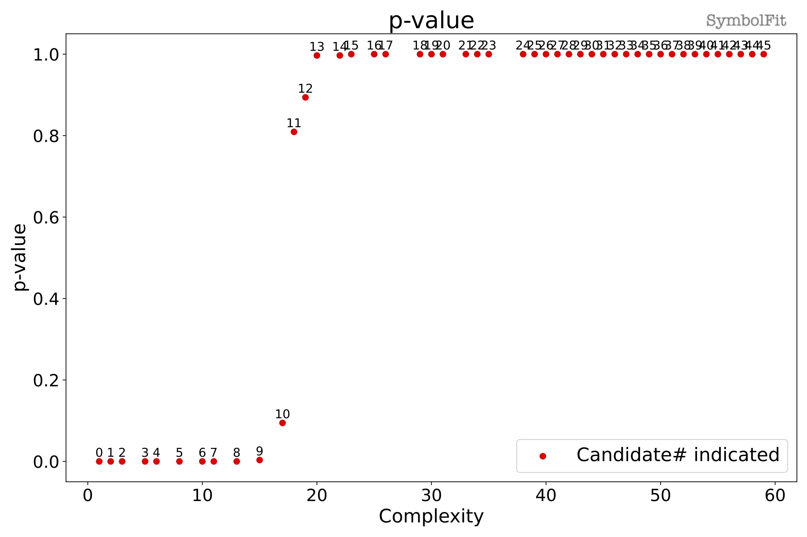
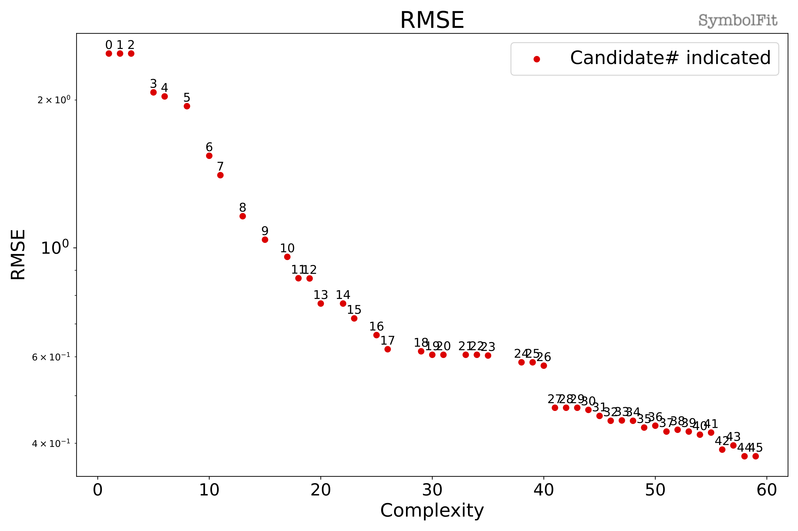
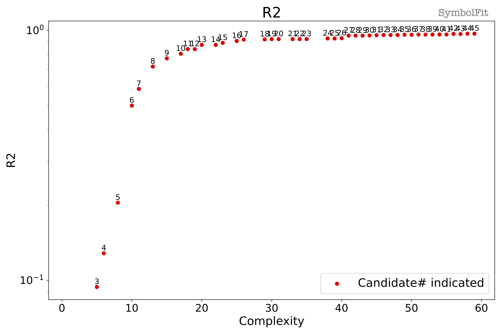
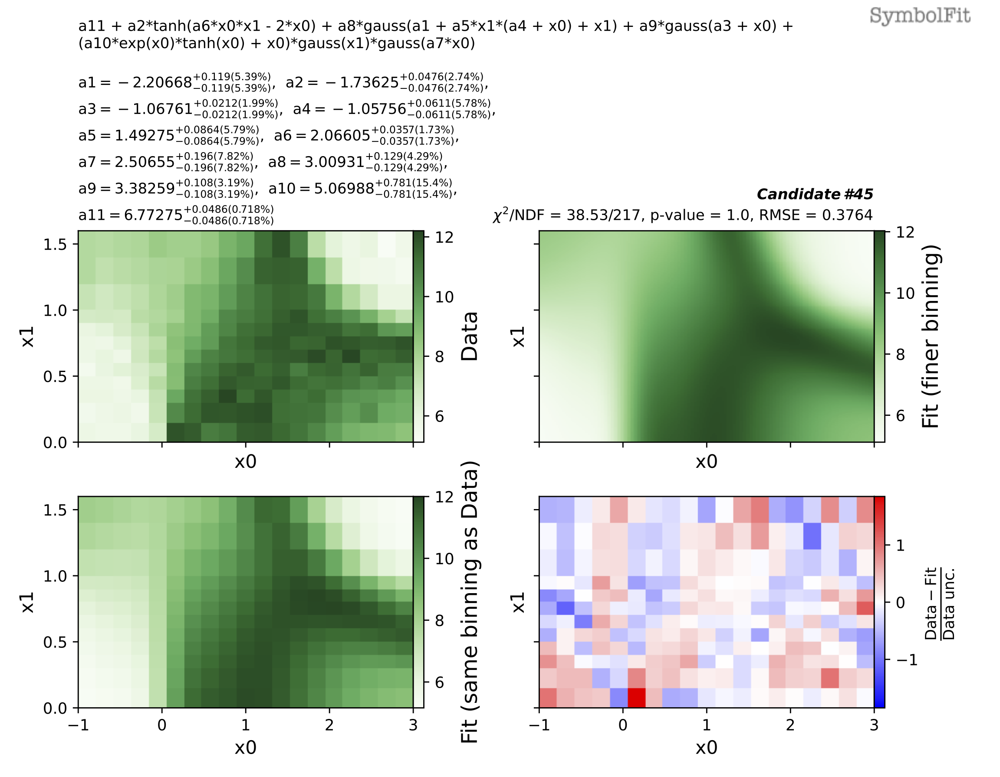
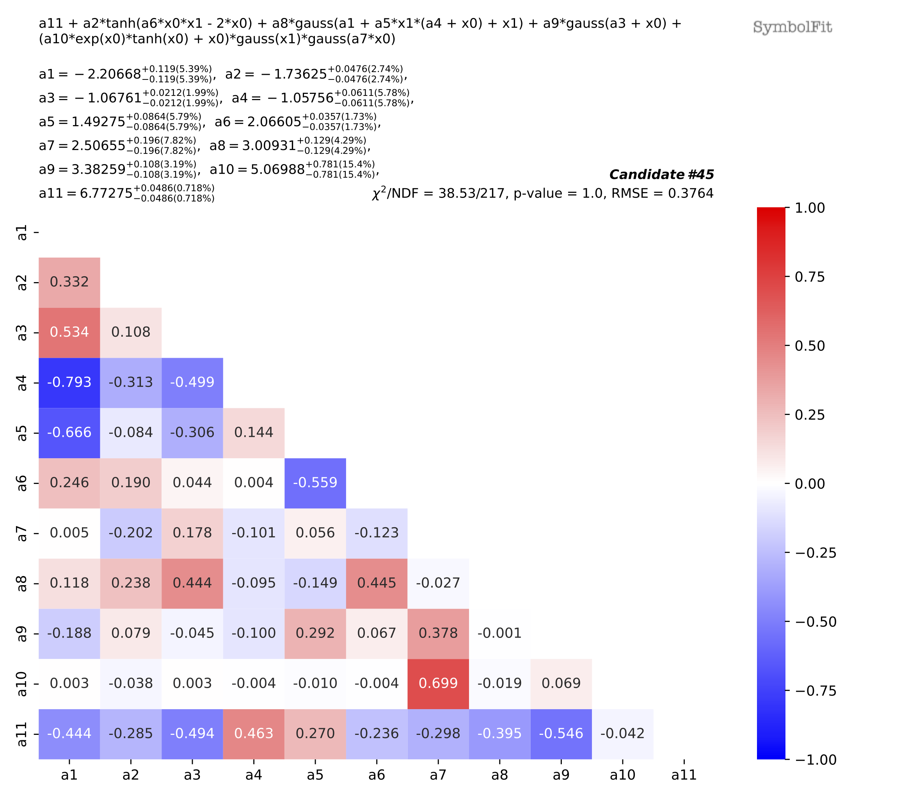

# Toy dataset 3c (2D)

See >>[notebook](notebooks/Toy_dataset_3c.ipynb)<< for the complete procedure.

This fit generates 46 candidate functions in total!
The output files can be found [here](https://github.com/hftsoi/symbolfit/tree/main/docs/demo/notebooks/output_Toy_dataset_3c) (feel free to download them and look at what a typical fit will produce).

Lets look at the output file `candidates_reduced.csv`, which is a csv table storing all candidate functions and their evaluations:

{{ read_csv("notebooks/output_Toy_dataset_3c/candidates_reduced.csv") }}

The goodness-of-fit scores are plotted in `candidates_gof.pdf`, such as the chi2/ndf:

For other goodness-of-fit scores:

??? note "Click to expand"
    

    **^ p-value**

    

    **^ Root-mean-square error**

    

    **^ Coefficient of determination R2**

Now, lets take a look at one of the candidate functions, say candidate #45.
The functional form can be found in the corresponding plots from the PDF files and in the csv table above, which is:

`a11 + a2*tanh(a6*x0*x1 - 2*x0) + a8*gauss(a1 + a5*x1*(a4 + x0) + x1) + a9*gauss(a3 + x0) + (a10*exp(x0)*tanh(x0) + x0)*gauss(x1)*gauss(a7*x0)`,

where the fitted parameters can be found at the `Parameters: (best-fit, +1, -1)` column in the csv files, or can be directly read off from the corresponding pdf files:

`{'a1': (-2.20668, 0.119, -0.119), 'a2': (-1.73625, 0.0476, -0.0476), 'a3': (-1.06761, 0.0212, -0.0212), 'a4': (-1.05756, 0.0611, -0.0611), 'a5': (1.49275, 0.0864, -0.0864), 'a6': (2.06605, 0.0357, -0.0357), 'a7': (2.50655, 0.196, -0.196), 'a8': (3.00931, 0.129, -0.129), 'a9': (3.38259, 0.108, -0.108), 'a10': (5.06988, 0.781, -0.781), 'a11': (6.77275, 0.0486, -0.0486)}`

The plots can be found in the pdf files:

with correlation matrix:

??? note "Click to expand"
    

!!! note
    Currently for 2D datasets, only the best-fit values of the parameters are considered for plotting the candidate functions in the output file `candidates.pdf`. The uncertainty variations/coverage will be added in a future release, stay tuned!

