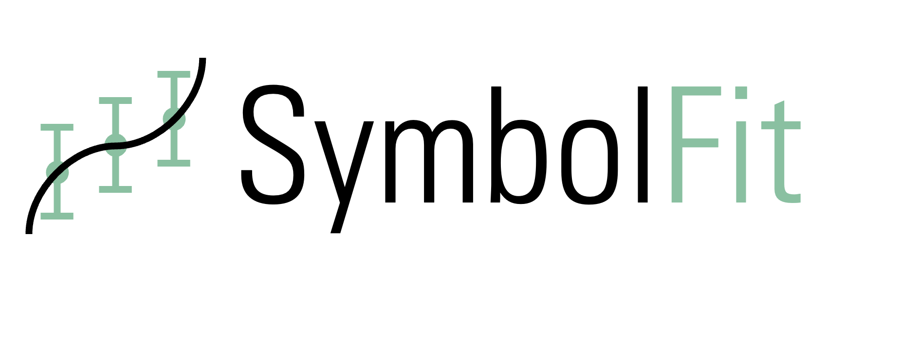
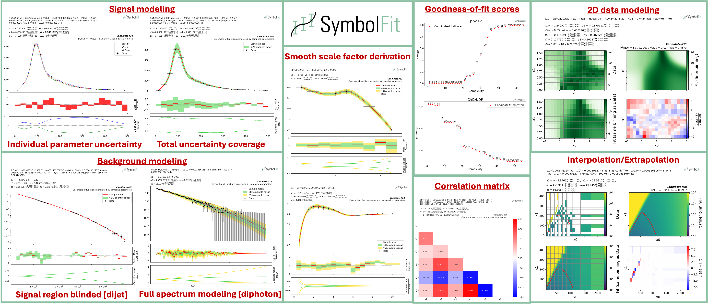

# Welcome to SymbolFit

  

  

  

Docs | Paper | Slides | Colab | pip | conda |
|:-:|:-:|:-:|:-:|:-:|:-:|
 |  |  |  |  |  |

## What is SymbolFit?

**SymbolFit automatically finds closed-form functions that fit your data with uncertainty estimation, no manual guessing required.**

SymbolFit was originally developed for experimental high-energy physics (HEP) analyses, but it works on any 1D, 2D, or higher-dimensional dataset where you need an interpretable parametric model with uncertainty estimates. You provide data points and SymbolFit returns a batch of candidate functions ranked by goodness-of-fit, each with optimized parameters and uncertainty estimates. All results are saved to CSV tables and PDF plots, ready for downstream use such as hypothesis testing in HEP.

Under the hood, it chains three steps into a single pipeline:

1. **Function search**: [PySR](https://github.com/MilesCranmer/PySR) (symbolic regression) explores combinations of mathematical operators to discover functional forms that fit the data, without requiring a predefined template.
2. **Re-optimization**: [LMFIT](https://github.com/lmfit/lmfit-py) re-optimizes the numerical parameters in each candidate function and provides uncertainty estimates via covariance matrices.
3. **Evaluation**: every candidate is automatically scored (chi2/NDF, p-value, RMSE, R2), plotted with individual uncertainty variations and total uncertainty coverage, and saved to output files.

## Navigation

| I want to... | Go to |
|---|---|
| Install and set up | [Installation](install.md) |
| Run my first fit | [Quick Start](quick_start.md) |
| Understand all options | [API Reference](class.md) |
| See example fits on real data | [Demos](demo/input.md) |
| Configure the function search | [PySR Configs](demo/pysr_configs.md) |

!!! note

    This API is being actively updated to accommodate more use cases, so any feedback and contributions are very much welcomed and appreciated! If you encounter any problems while using it, please don't hesitate to raise questions or report bugs at [Issues](https://github.com/hftsoi/symbolfit/issues). If you need further help, also feel free to drop me a message as I am happy to assist in getting it to work on your data!
