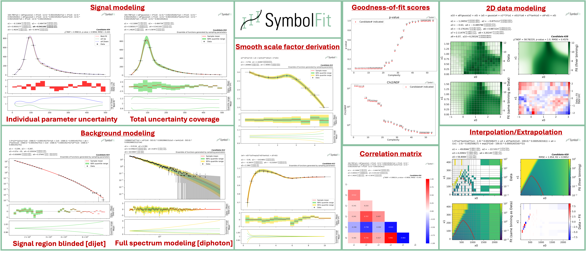

# Welcome to SymbolFit documentation!

  

  

  

Docs | Paper | Slides | Colab | pip | conda |
|:-:|:-:|:-:|:-:|:-:|:-:|
 |  |  |  |  |  |

An API to automate parametric modeling with symbolic regression, originally developed for data analysis in the experimental high-energy physics community, but also applicable beyond.

SymbolFit takes binned data with measurement/systematic uncertainties (optional) as input, utilizes [PySR](https://github.com/MilesCranmer/PySR) to perform a machine-search for batches of functional forms that model the data, parameterizes these functions, and utilizes [LMFIT](https://github.com/lmfit/lmfit-py) to re-optimize the functions and provide uncertainty estimation, all in one go.
It is designed to maximize automation with minimal human input. Each run produces a batch of functions with uncertainty estimation, which are evaluated, saved, and plotted automatically into readable output files, ready for downstream tasks.

In short, `symbolfit` = `pysr (symbolic regression to generate functional forms)` + `lmfit (re-optimization & uncertainty modeling)` + `auto-evaluation tools (parameter correlation, uncertainty variation and coverage, statistical tests, etc.)`.

!!! note

    This API is being actively updated to accommodate more use cases, so any feedback and contributions are very much welcomed and appreciated! If you encounter any problems while using it, please don't hesitate to raise questions or report bugs at [Issues](https://github.com/hftsoi/symbolfit/issues). If you need further help, also feel free to drop me a message as I am happy to assist in getting it to work on your data!
