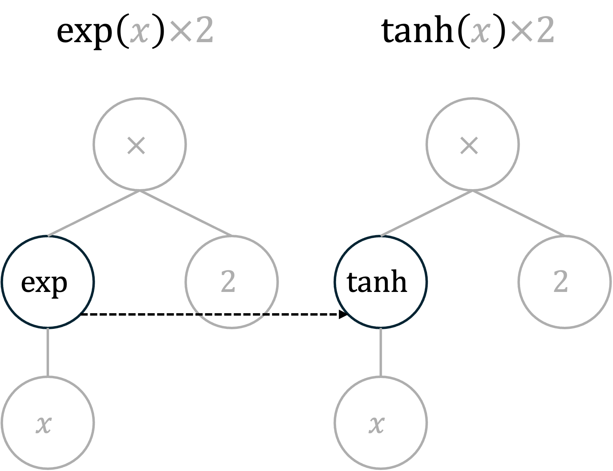
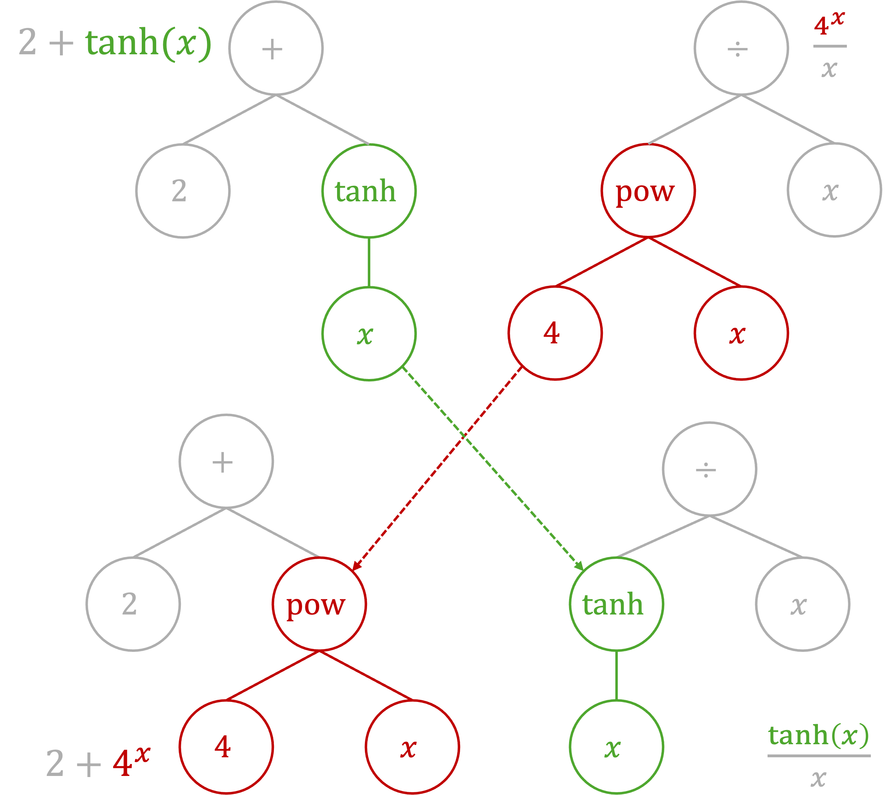

# Why SymbolFit?

Whenever you need to find smooth, closed-form functions to model a
dataset, whether it consists of scattered data points or a binned
histogram, SymbolFit automates the entire process for you!

Traditionally, parametric modeling methods have been empirical,
requiring an exact functional form to be fixed before fitting. For
example, if the data follows a simple trend, polynomial regression might
be sufficient; if the distribution has a peak followed by a long tail, a
combination of a Gaussian and an exponential might barely work. But what
if the data is more complex, and simple function templates fail to fit
adequately, leaving you no clue how to construct a suitable functional
form? The only option has been to manually create a complex function and
test it through a trial-and-error process, which can take hundreds of
iterations.

In most real-world scenarios, distribution shapes are arbitrary, and no
true underlying function exists that can be derived from first
principles. This often results in an empirical process: manually guess a
functional form, attempt to fit, and if the fit is poor, go back to
hand-crafting another candidate, repeating until an acceptable function
is found.

Moreover, the functional form that works for one dataset is often
tailored specifically to it and may not generalize well to another
dataset, even if they share a similar shape, requiring the same
empirical and time-consuming effort for each new case. Examples of this
inefficiency can be seen in various recent new physics search analyses
at the CERN Large Hadron Collider, such as
[dijet](https://arxiv.org/abs/1911.03947),
[trijet](https://arxiv.org/abs/2310.14023),
[paired-dijet](https://arxiv.org/abs/2206.09997),
[diphoton](https://arxiv.org/abs/2405.09320), and
[dimuon](https://arxiv.org/abs/2307.08708), and, surprisingly, in the
analyses that led to the Higgs boson discovery in 2012 by
[ATLAS](https://arxiv.org/abs/1207.7214) and
[CMS](https://arxiv.org/abs/1207.7235)!

This approach is highly inefficient.

Fortunately, symbolic regression, a powerful machine learning technique,
can address this and has the potential to transform the approach to
parametric modeling.

## Symbolic regression

Essentially, symbolic regression is a method that searches for functions
to fit data without requiring a predefined functional form. Instead,
symbolic regression constructs and evolves functions throughout the
fitting process, with functional forms dynamically changing until the
best ones are identified by minimizing a given loss function.

A common approach to symbolic regression is genetic programming, where a
function is represented as an expression tree. New functions are born
through node mutation and subtree crossover, as illustrated in the
figure below.

  ----------------------------------------------- ------------------------------------------------
  {width="240px"}   {width="320px"}

  ----------------------------------------------- ------------------------------------------------

In symbolic regression, the function space is defined through allowed
operators and function constraints. This approach does not require prior
or extensive knowledge of the final functional forms that can fit the
data, as the function search is handled by the machine.

## SymbolFit API

The SymbolFit API is developed to automate parametric modeling using
symbolic regression. The framework is illustrated in the schematic
sketch below.

{.align-center width="800px"}

First, it interfaces with [PySR](https://github.com/MilesCranmer/PySR),
a high-performance symbolic regression library, to perform an initial
machine search for suitable functional forms that fit the data. Due to
the nature of genetic programming, PySR returns a batch of functions per
fit. These initial candidate functions are exact functions without
uncertainty modeling, as symbolic regression algorithms focus on finding
functional forms and do not inherently estimate uncertainty. However,
describing uncertainty when modeling data is crucial, especially in
physics modeling for high-energy physics experiments, as it indicates
the reliability of the model's representation of observed data.
Moreover, numerical constants in these initial candidate functions may
not be highly optimized and can be further improved.

To address this, SymbolFit reprocesses these initial functions and
parameterizes them for re-optimization. First, all numerical constants
in each initial function are identified and parameterized. SymbolFit
then parses these parameterized functions and interfaces with
[LMFIT](https://github.com/lmfit/lmfit-py), a nonlinear least-squares
minimization library, to re-optimize the parameters while keeping the
original functional forms fixed. After re-optimization, the best-fit
parameters are refined and come with associated uncertainty estimates.
The combined uncertainty in the parameters is then used as the
uncertainty of the candidate function.

SymbolFit chains all these steps together and performs evaluations in
one go. The outputs include essential statistical elements for each
candidate function, which are automatically saved and plotted in easily
readable formats (CSV tables and PDF plots), making them ready for
downstream tasks.

## An example

Below is an example demonstrating that a single run of SymbolFit
generates a variety of candidate functions, illustrating the convergence
from less complex to more complex functions that can effectively fit a
nontrivial distribution shape.

{.align-center width="900px"}
