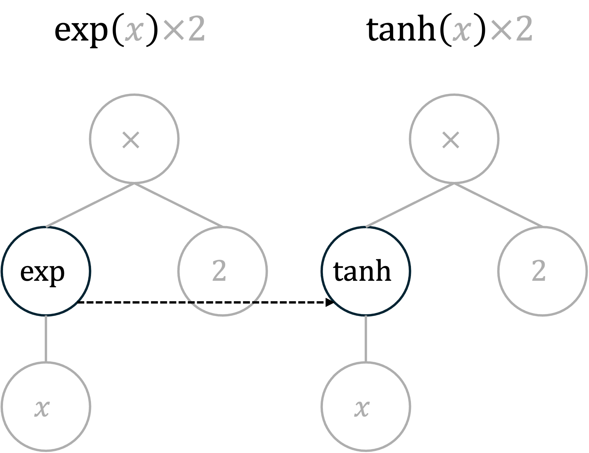
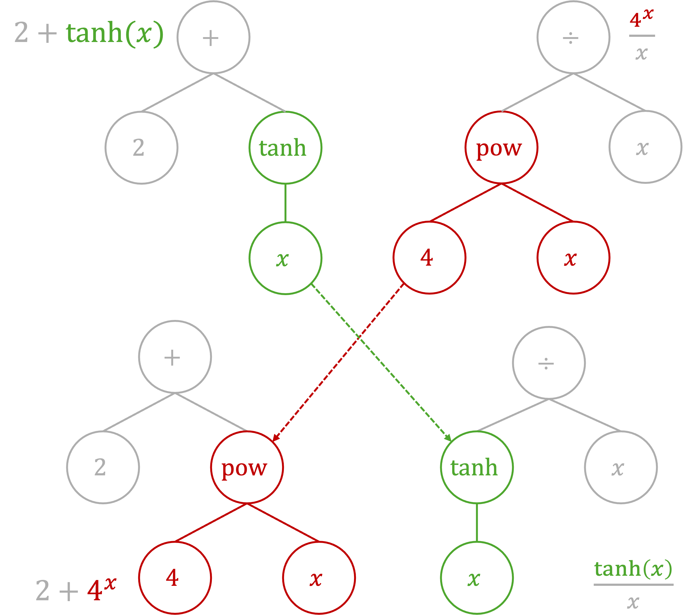
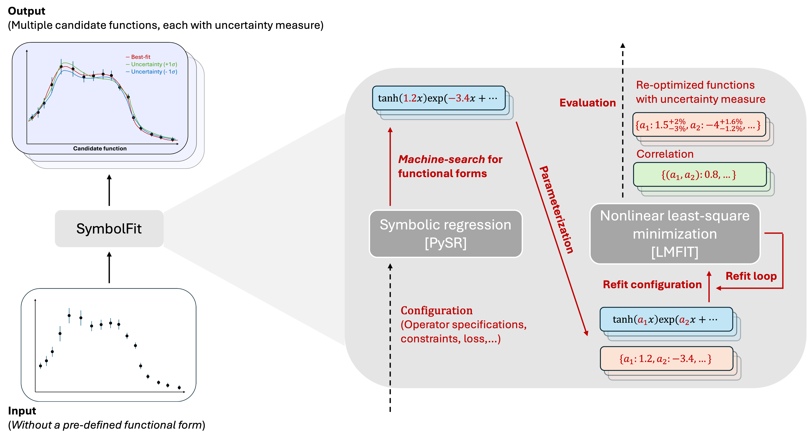

# Why SymbolFit?

## The problem: manual function guessing

Whenever you need to find a smooth, closed-form function to model a dataset, whether it consists of scattered data points or a binned histogram, the traditional approach is tedious and manual:

1. **Guess** a functional form (polynomial, exponential, Gaussian, etc.).
2. **Fit** it to the data.
3. **Evaluate** the fit quality.
4. If it's not good enough, **go back to step 1** and try a different form.

This trial-and-error process can take dozens to hundreds of iterations, and the function that works for one dataset rarely generalizes to another.

For simple cases (e.g., a linear trend or a clean exponential decay), this works fine. But what if the data has a complex shape, e.g., a peak followed by a long tail, multiple overlapping features, or a distribution that doesn't match any textbook function? Manually constructing and testing candidates becomes extremely time-consuming, especially when you need reliable uncertainty estimates on top of the fit.

This inefficiency shows up across many fields. In experimental high-energy physics (HEP), for example, some new physics searches at the CERN Large Hadron Collider (LHC) require empirical background modeling with custom functions hand-crafted for each analysis, including recent searches in [dijet](https://arxiv.org/abs/1911.03947), [trijet](https://arxiv.org/abs/2310.14023), [paired-dijet](https://arxiv.org/abs/2206.09997), [diphoton](https://arxiv.org/abs/2405.09320), and [dimuon](https://arxiv.org/abs/2307.08708) channels, and even the analyses that led to the Higgs boson discovery by [ATLAS](https://arxiv.org/abs/1207.7214) and [CMS](https://arxiv.org/abs/1207.7235).

**SymbolFit automates this entire process.**

## How it works: symbolic regression

Instead of requiring you to specify a functional form upfront, symbolic regression **searches** for functions that fit the data. It constructs and evolves mathematical expressions using a given set of operators, dynamically combining them until it finds the best ones.

A common approach is genetic programming, where functions are represented as expression trees. New candidate functions are created through mutation (changing a node) and crossover (swapping subtrees between two candidates):

  ----------------------------------------------- ------------------------------------------------
  {width="240px"}   {width="320px"}

  ----------------------------------------------- ------------------------------------------------

You define the search space by choosing which operators to allow (e.g., `+`, `*`, `exp`, `tanh`). The search handles the rest without needing prior knowledge of the final functional form.

## The SymbolFit pipeline

SymbolFit wraps the full modeling workflow into a single automated pipeline:

{.align-center width="800px"}

**Step 1: Function search (PySR)**

SymbolFit interfaces with [PySR](https://github.com/MilesCranmer/PySR), a high-performance symbolic regression library, to search for functional forms that fit the data. PySR returns a batch of candidate functions per run, ranging from simple to complex.

**Step 2: Parameterization and re-optimization (LMFIT)**

The initial candidates from PySR have hard-coded numerical constants that may not be fully optimized, and they lack uncertainty estimates. SymbolFit addresses this by:

1. Identifying all numerical constants in each candidate and replacing them with named parameters (`a1`, `a2`, ...).
2. Re-optimizing these parameters using [LMFIT](https://github.com/lmfit/lmfit-py) (nonlinear least-squares minimization), which refines the values and provides uncertainty estimates via covariance matrices.

**Step 3: Evaluation and output**

Every candidate function is automatically evaluated with standard goodness-of-fit metrics (chi2/NDF, p-value, RMSE, R2) and saved with full diagnostic information:

- **CSV tables** with functions, parameters, uncertainties, and scores
- **PDF plots** showing each candidate against data, uncertainty variations, sampling-based uncertainty bands, goodness-of-fit summaries, and parameter correlation matrices

All results are ready for downstream use without additional processing.

## An example

Below is an example demonstrating that a single run of SymbolFit generates a variety of candidate functions, illustrating the convergence from less complex to more complex functions that can effectively fit a nontrivial distribution shape.

{.align-center width="900px"}

Introductory slides can also be found [here](https://github.com/hftsoi/symbolfit/blob/main/symbolfit.pdf).
